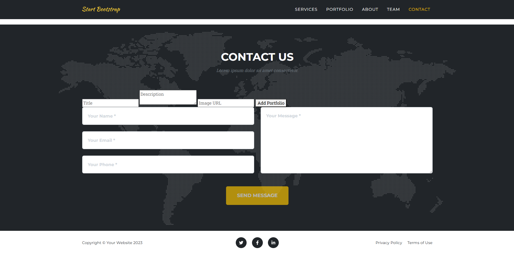
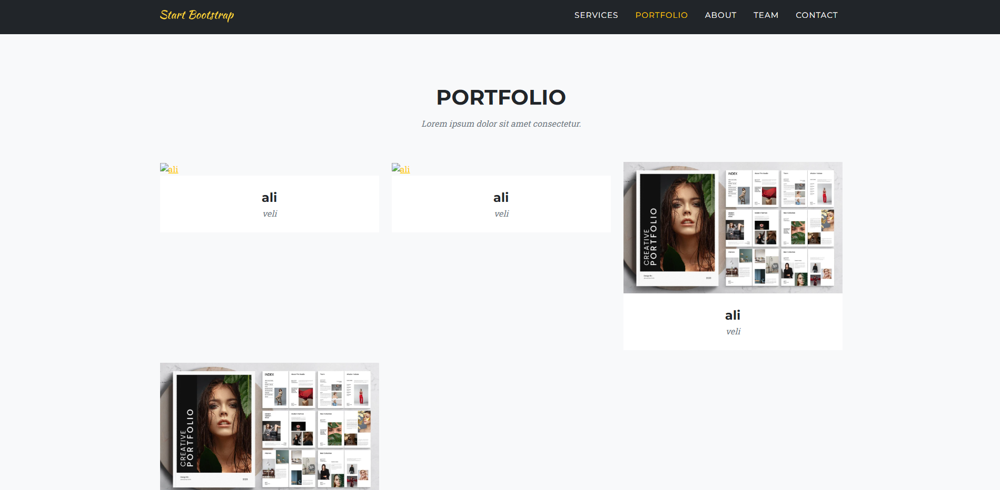
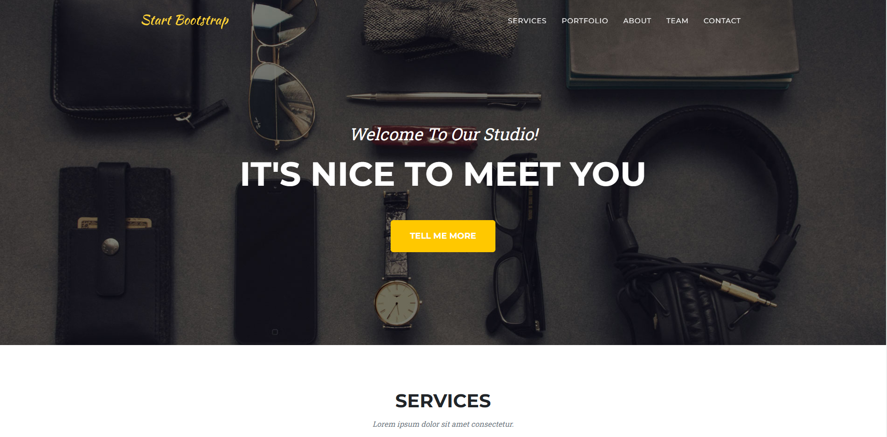

# Agency Project

This project is a dynamic portfolio website based on the **Start Bootstrap - Agency** template. The portfolio section is designed to be dynamic, using a backend API for CRUD operations. Below are the details of the project structure, setup, and usage.

---

## Project Structure

```
.
├── assets/
│   ├── favicon.ico
│   ├── img/
│   │   ├── portfolio/   # Default portfolio images
│   │   ├── about/       # About section images
│   ├── agencyresim/     # Custom project images
├── css/
│   ├── styles.css       # Core CSS styles
├── public/
│   ├── index.html       # Main HTML file
├── scripts.js           # JavaScript file for interactivity
├── server.js            # Node.js backend server
└── README.md            # Project documentation (this file)
```

---

## Features

1. **Dynamic Portfolio Section**
    - Add, edit, and delete portfolio items via a backend API.
    - Portfolio items support image uploads, titles, and descriptions.

2. **Static Sections**
    - `About`, `Services`, `Team`, and `Contact` sections are static.

3. **Responsive Design**
    - Fully responsive layout based on Bootstrap 5.

---

## Setup and Installation

### Prerequisites

- Node.js (latest LTS version recommended)
- npm (comes with Node.js)

### Steps

1. **Clone the Repository**
   ```bash
   git clone <repository-url>
   cd agency
   ```

2. **Install Dependencies**
   ```bash
   npm install
   ```

3. **Start the Backend Server**
   ```bash
   node server.js
   ```
   The backend server runs at `http://localhost:3000`.

4. **Run the Frontend**
    - Use a local server tool like Live Server or Python's HTTP server:
      ```bash
      python -m http.server 5500
      ```
    - Open `http://localhost:5500` in your browser.

---

## API Endpoints

### Base URL: `http://localhost:3000`

#### 1. **Get All Portfolio Items**
   ```http
   GET /api/portfolio
   ```
Response:
   ```json
   [
       {
           "id": 123456,
           "title": "Project Title",
           "description": "Project Description",
           "image": "https://example.com/image.jpg"
       }
   ]
   ```

#### 2. **Add a Portfolio Item**
   ```http
   POST /api/portfolio
   ```
Body:
   ```json
   {
       "title": "Project Title",
       "description": "Project Description",
       "image": "https://example.com/image.jpg"
   }
   ```

#### 3. **Edit a Portfolio Item**
   ```http
   PUT /api/portfolio/:id
   ```
Body:
   ```json
   {
       "title": "Updated Title",
       "description": "Updated Description",
       "image": "https://example.com/new-image.jpg"
   }
   ```

#### 4. **Delete a Portfolio Item**
   ```http
   DELETE /api/portfolio/:id
   ```

---

## Adding Project Images

1. Add your images to the `assets/agencyresim/` directory.
2. Reference these images in the `image` field of the portfolio items.
   Example:
   ```json
   {
       "title": "My Project",
       "description": "This is a description.",
       "image": "assets/agencyresim/my-project.jpg"
   }
   ```

---

## Example Portfolio Items

| Title       | Description  | Image Path                             |
|-------------|--------------|----------------------------------------|
| Project 1   | Screenshot 1 |  |
| Project 2   | Screenshot 2 |  |
| Project 3   | Screenshot 3 |  |

---

## License

This project is based on the **Start Bootstrap - Agency** template, licensed under MIT.
